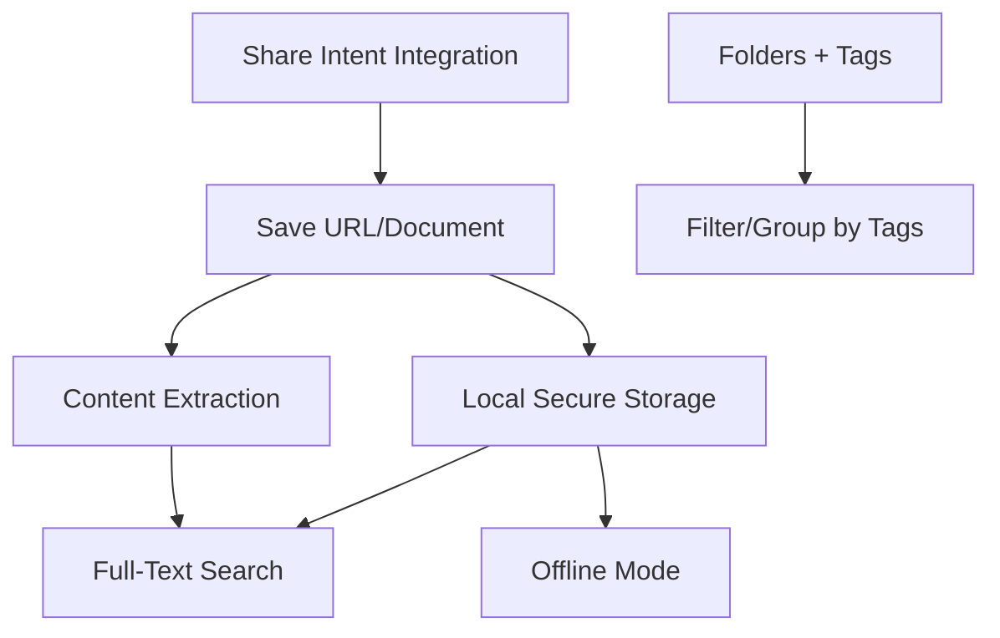

# Feature Landscape: Mnemata

**Domain:** Cross-platform Knowledge and Reference Manager
**Researched:** May 22, 2024 (Updated to 2026 Ecosystem Trends)
**Overall Confidence:** HIGH

## Table Stakes

Features users expect in 2026. If these are missing, the product will be perceived as incomplete or unreliable compared to established players like Raindrop.io or Instapaper.

| Feature | Why Expected | Complexity | Notes |
|---------|--------------|------------|-------|
| **Native Share Integration** | Core workflow for saving "on the go" from browsers and other apps. | Medium | Requires platform-specific extension code (iOS Share Extension, Android Intent). |
| **Content Extraction** | Users expect a "clean" reading experience (no ads, popups, or sidebars). | High | Needs a robust parsing engine (e.g., Mercury-style) that handles diverse site structures. |
| **Full-Text Search (FTS)** | Modern users don't want to "browse" for everything; they expect to find any word in any saved item. | Medium | Requires indexing content locally (SQLite FTS5) or server-side. |
| **Offline Mode** | Essential for commuting or travel; the "save for later" promise implies "available anywhere." | Medium | Requires local caching of extracted content and binary files (PDFs/Images). |
| **Cross-Platform Sync** | Users move between phones, tablets, and desktops seamlessly. | High | Requires robust conflict resolution and background data synchronization. |
| **Basic Organization** | Ability to categorize items via either folders or tags is standard. | Low | Must support at least one; Mnemata supports both. |

## Differentiators

Features that set Mnemata apart from competitors and provide a unique value proposition.

| Feature | Value Proposition | Complexity | Notes |
|---------|-------------------|------------|-------|
| **Hybrid Organization** | Combines hierarchical (folders) and associative (tags) mental models. | Medium | Most apps force one or the other. Mnemata's "infinite tree + tags" is a major flexibility win. |
| **Local Secure Storage** | Ensures "Permanent Archive" / Link Rot protection by copying documents and content to private storage. | Medium | Provides privacy and data sovereignty, unlike cloud-only link savers. |
| **Reading History (Last 20)** | Reduces friction for users jumping between recent tasks or finishing a long read. | Low | A simple but effective UX "magic moment" for power users. |
| **Native Gesture UX** | High-performance swiping for actions (Share/Edit) makes the app feel "native" and fast. | Medium | Requires careful UI implementation to ensure zero-latency responsiveness. |
| **Universal Reference Support**| Treating URLs, PDFs, and Images as equal citizens in a single repository. | Medium | Many apps are "URLs only" (Pocket) or "PDFs only" (Zotero/Mendeley). |

## Anti-Features

Features to explicitly NOT build to maintain focus and performance.

| Anti-Feature | Why Avoid | What to Do Instead |
|--------------|-----------|-------------------|
| **Social Feed / Discovery** | Causes "bloat" and distraction; Mnemata is a *personal* repository. | Focus on high-quality organization and retrieval of *user-added* content. |
| **Full Note Editor** | Competing with Obsidian/Notion adds massive complexity and drifts from "Reference Manager." | Provide simple "Notes" or "Annotate" field on items, then allow export to note apps. |
| **Proprietary Formats** | Increases user anxiety about "lock-in" and data loss. | Use open standards for storage and provide a robust "Export All" feature (CSV/JSON/PDF). |
| **AI Recommendation Engine**| Can feel invasive and often suggests low-quality "clickbait" (e.g., late-stage Pocket). | Use AI for *utility* (e.g., better extraction or auto-tagging) rather than discovery. |

## Feature Dependencies

## MVP Recommendation

Prioritize building the "Reflective Loop": Save → Extract → Search → Read.

1. **Table Stakes: Native Share Integration** - Must be frictionless to get data *into* the app.
2. **Table Stakes: Content Extraction & FTS** - The primary value is being able to *find* and *read* what was saved.
3. **Differentiator: Hybrid Organization (Folders + Tags)** - Establish the unique organizational model early.
4. **Differentiator: Reading History** - High-value, low-complexity feature for immediate UX improvement.

**Defer:**
- **AI-powered Summarization**: Valuable but high complexity; manual extraction is enough for MVP.
- **Collaborative Folders**: High sync complexity; focus on single-user experience first.

## Sources

- [Raindrop.io Feature Comparison (2026)](https://raindrop.io)
- [Readwise Reader "Reading Workflow" Best Practices](https://readwise.io/read)
- [iOS/Android Share Intent Guidelines (2026 Update)](https://developer.apple.com)
- [Community Feedback on Pocket Discontinuation (July 2025)](https://reddit.com/r/productivity)
